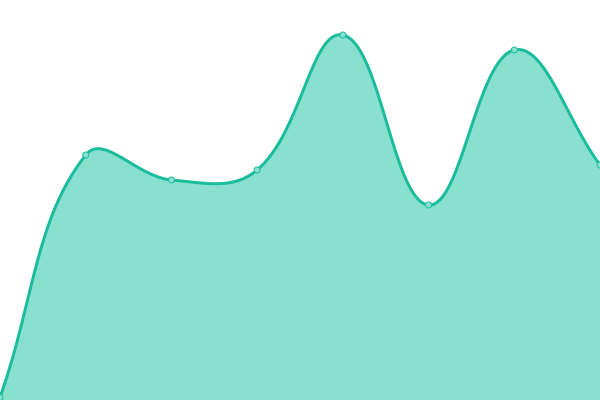
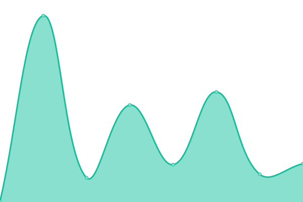
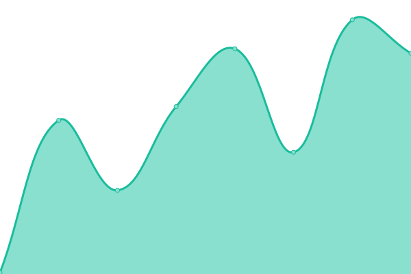
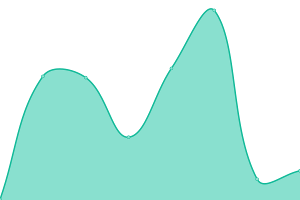
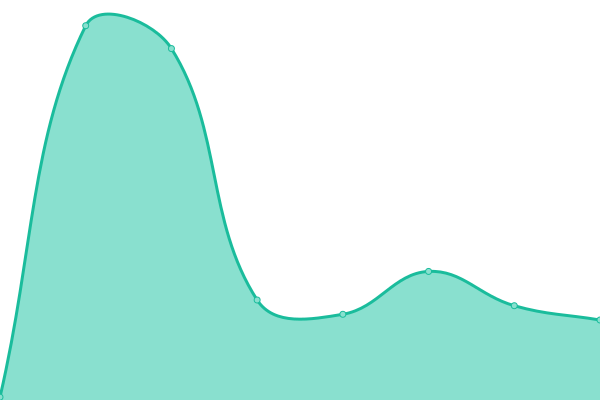

# [📈 Live Status](https://upptime.github.io/upptime): <!--live status--> **🟩 All systems operational**

This repository contains the open-source uptime monitor and status page for [Upptime](https://upptime.js.org), powered by [Upptime](https://github.com/upptime/upptime).

With [Upptime](https://upptime.js.org), you can get your own unlimited and free uptime monitor and status page, powered entirely by a GitHub repository. We use [Issues](https://github.com/upptime/upptime/issues) as incident reports, [Actions](https://github.com/nprasad2077/upptime/actions) as uptime monitors, and [Pages](https://upptime.github.io/upptime) for the status page.

<!--start: status pages-->
<!-- This summary is generated by Upptime (https://github.com/upptime/upptime) -->
<!-- Do not edit this manually, your changes will be overwritten -->
<!-- prettier-ignore -->
| URL | Status | History | Response Time | Uptime |
| --- | ------ | ------- | ------------- | ------ |
|  [Google](https://www.google.com) | 🟩 Up | [google.yml](https://github.com/nprasad2077/upptime/commits/HEAD/history/google.yml) | 

 74ms
     
 | 

<a href="https://nprasad2077.github.io/upptime/history/google">100.00%</a>
    

|  [Wikipedia](https://en.wikipedia.org) | 🟩 Up | [wikipedia.yml](https://github.com/nprasad2077/upptime/commits/HEAD/history/wikipedia.yml) | 

 209ms
     
 | 

<a href="https://nprasad2077.github.io/upptime/history/wikipedia">100.00%</a>
    

|  [Hacker News](https://news.ycombinator.com) | 🟩 Up | [hacker-news.yml](https://github.com/nprasad2077/upptime/commits/HEAD/history/hacker-news.yml) | 

 313ms
     
 | 

<a href="https://nprasad2077.github.io/upptime/history/hacker-news">100.00%</a>
    

|  [Portfolio](https://nikhil.engineer/) | 🟩 Up | [portfolio.yml](https://github.com/nprasad2077/upptime/commits/HEAD/history/portfolio.yml) | 

 330ms
     
 | 

<a href="https://nprasad2077.github.io/upptime/history/portfolio">100.00%</a>
    

|  [NBA Stats](https://nba-stats-beryl.vercel.app/) | 🟩 Up | [nba-stats.yml](https://github.com/nprasad2077/upptime/commits/HEAD/history/nba-stats.yml) | 

 109ms
     
 | 

<a href="https://nprasad2077.github.io/upptime/history/nba-stats">100.00%</a>
    

|  [Nasa Capstone](https://nasa-capstone.vercel.app/) | 🟩 Up | [nasa-capstone.yml](https://github.com/nprasad2077/upptime/commits/HEAD/history/nasa-capstone.yml) | 

 85ms
     
 | 

<a href="https://nprasad2077.github.io/upptime/history/nasa-capstone">100.00%</a>
    

|  [ProShop](https://proshop-nikhil.herokuapp.com/) | 🟩 Up | [pro-shop.yml](https://github.com/nprasad2077/upptime/commits/HEAD/history/pro-shop.yml) | 

 134ms
     
 | 

<a href="https://nprasad2077.github.io/upptime/history/pro-shop">100.00%</a>
    

|  [iPhone GUI](https://apple-iphone-gui.netlify.app/) | 🟩 Up | [i-phone-gui.yml](https://github.com/nprasad2077/upptime/commits/HEAD/history/i-phone-gui.yml) | 

 120ms
     
 | 

<a href="https://nprasad2077.github.io/upptime/history/i-phone-gui">100.00%</a>
    

|  [Nasa Capstone V1](https://github.com/nprasad2077/nasa_capstone) | 🟩 Up | [nasa-capstone-v1.yml](https://github.com/nprasad2077/upptime/commits/HEAD/history/nasa-capstone-v1.yml) | 

 425ms
     
 | 

<a href="https://nprasad2077.github.io/upptime/history/nasa-capstone-v1">100.00%</a>
    

|  [Pokemon Match](https://nprasad2077.github.io/project-1/lib/index.html) | 🟩 Up | [pokemon-match.yml](https://github.com/nprasad2077/upptime/commits/HEAD/history/pokemon-match.yml) | 

 91ms
     
 | 

<a href="https://nprasad2077.github.io/upptime/history/pokemon-match">100.00%</a>
    

|  [Angular Store](https://nprasad2077.github.io/storeAngular/) | 🟩 Up | [angular-store.yml](https://github.com/nprasad2077/upptime/commits/HEAD/history/angular-store.yml) | 

 54ms
     
 | 

<a href="https://nprasad2077.github.io/upptime/history/angular-store">100.00%</a>
    

<!--end: status pages-->

[**Visit our status website →**](https://upptime.github.io/upptime)

## 📄 License

- Powered by: [Upptime](https://github.com/upptime/upptime)
- Code: [MIT](./LICENSE) © [Upptime](https://upptime.js.org)
- Data in the `./history` directory: [Open Database License](https://opendatacommons.org/licenses/odbl/1-0/)
